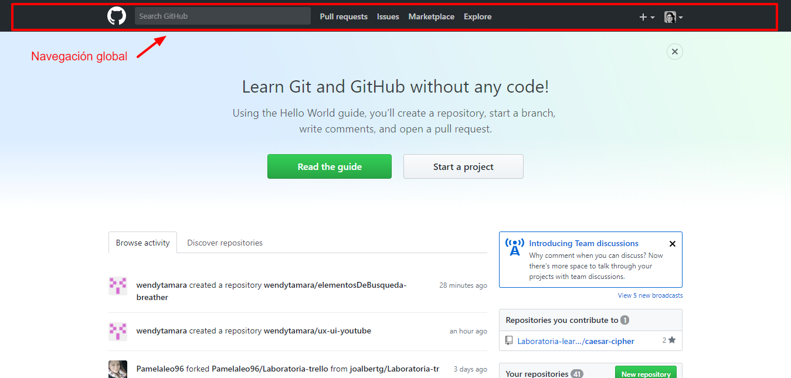
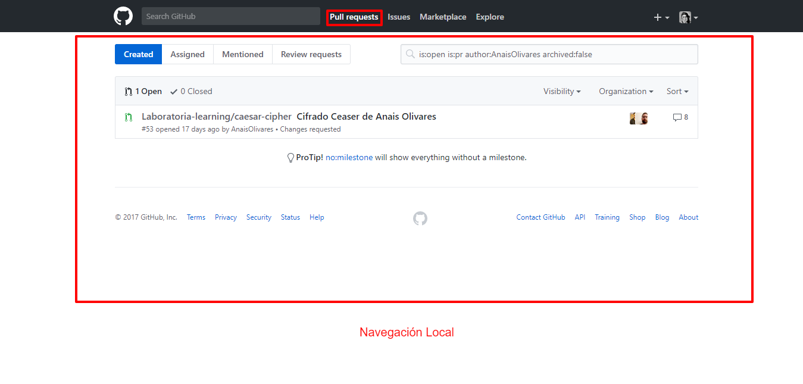
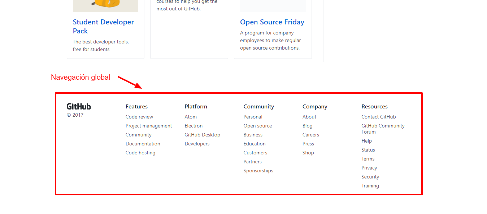
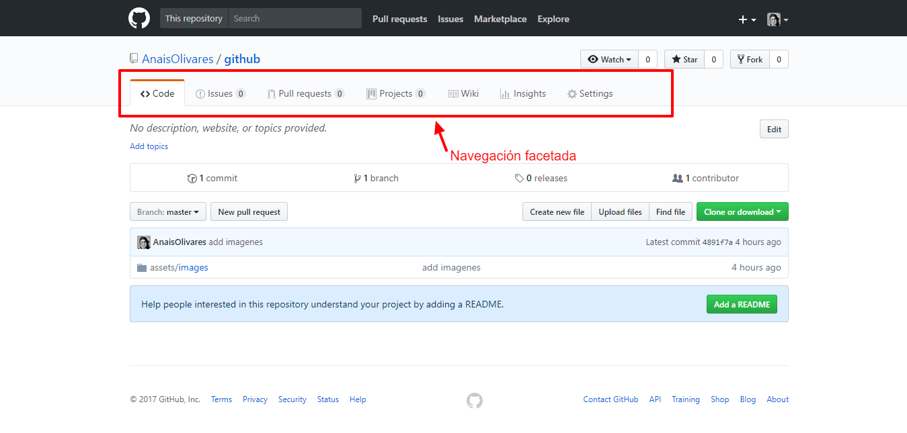
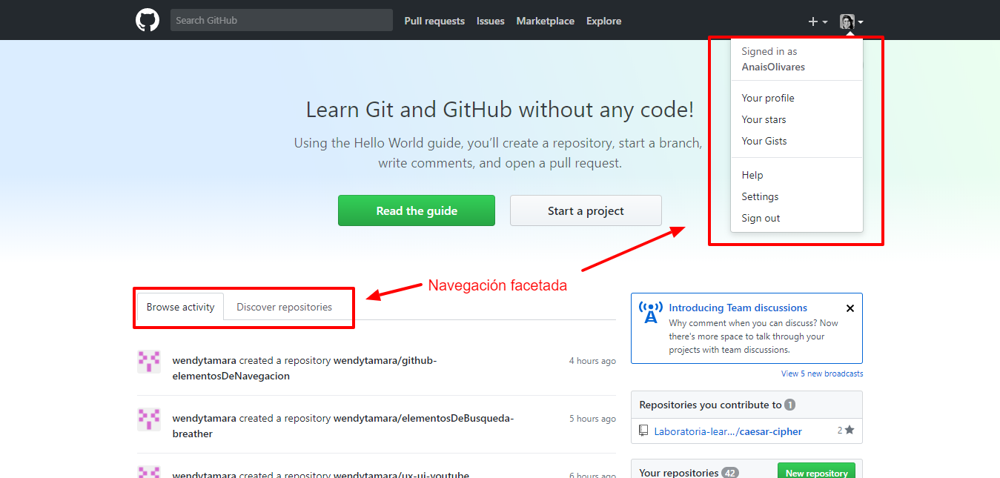
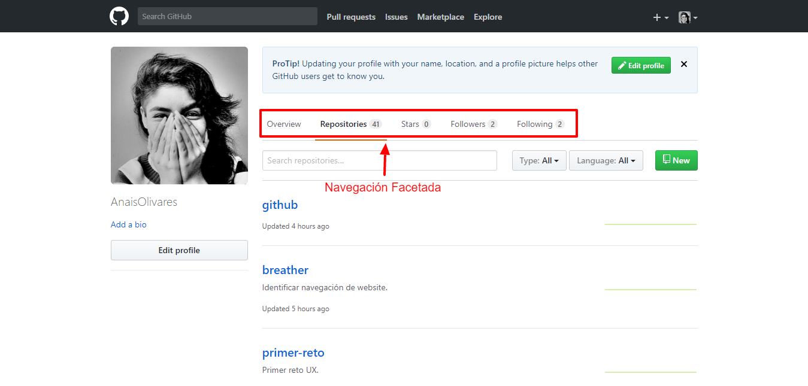
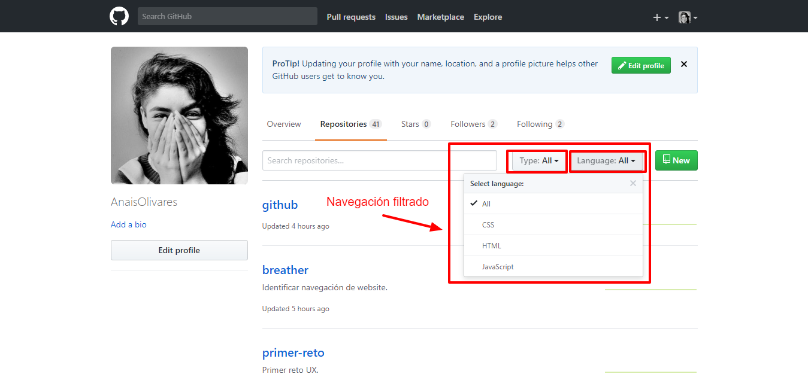

## GITHUB
### Navegación
>Identificar los tipos de navegación de la website, Github.

>Global, por que engloba la página en general.

>Navegación local por que es el menú que aparece al seleccionar el menú local.

>Global por que engloba todas las partes de la website.

>Facetada por que te aparecen secciones predefinidas.

> Viene categorías predefinidas.

>Filtrada por que me permite elegir cosas con las mismas características.
